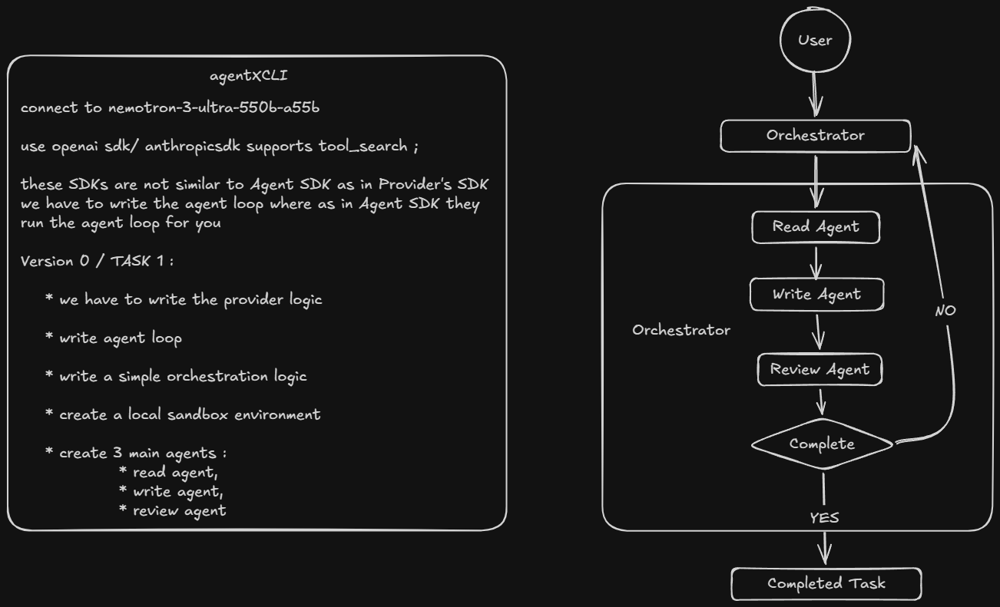
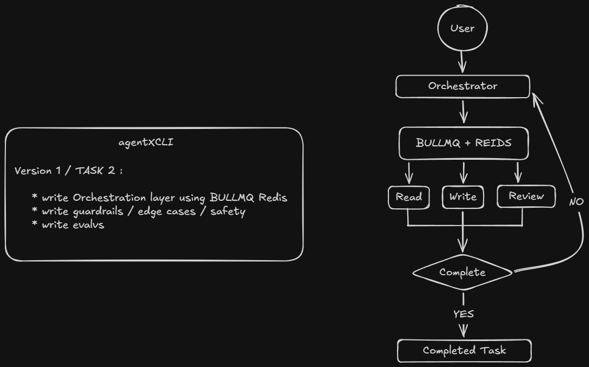
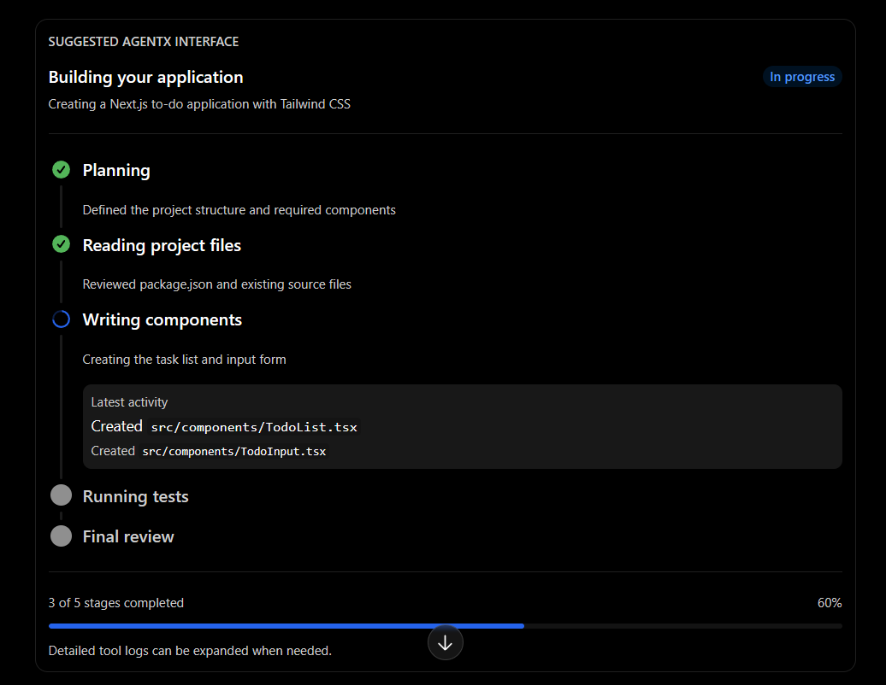

# AgentX CLI
```
npm install
npm link
```
starter commands 
* agentx -p "Your_Prompt_Here"  
* -p for prompt

### TODO

* [o] Connect to the LLM API
* [ ] write agent loop
* [ ] Create the orchestration layer
* [ ] Create the sandbox environment
* [ ] Create read, write, agents
* [ ] Complete Version 0
* [ ] Integrate BullMQ and Redis
* [ ] Complete Version 1
* [ ] ADD Mermaid for creating good looking flowcharts


## Version 0

**`in the diagram, the box below orchestrator is sandbox`**

## Version 1



## Execution UI
